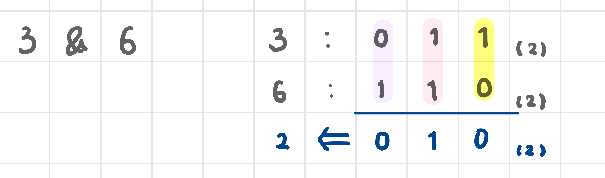
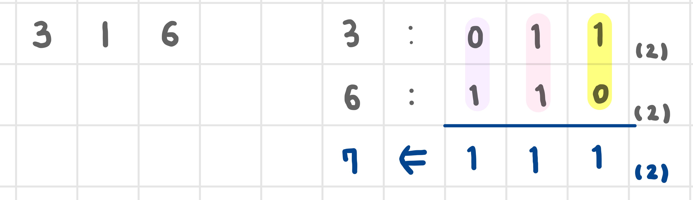
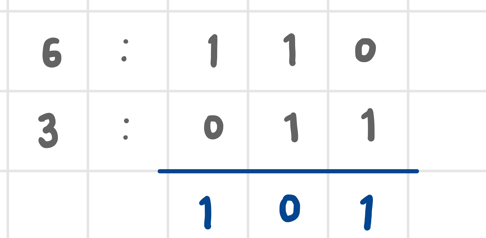
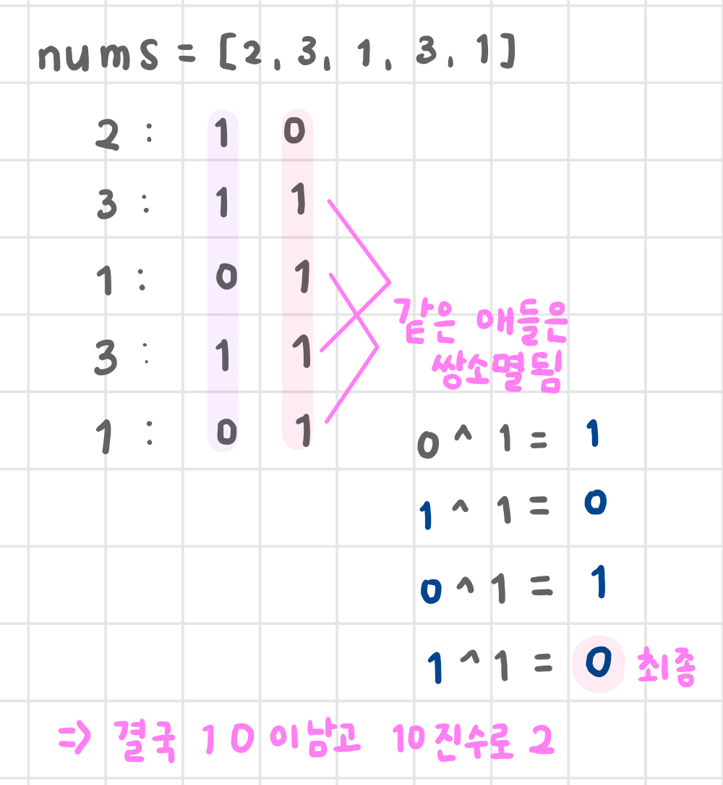
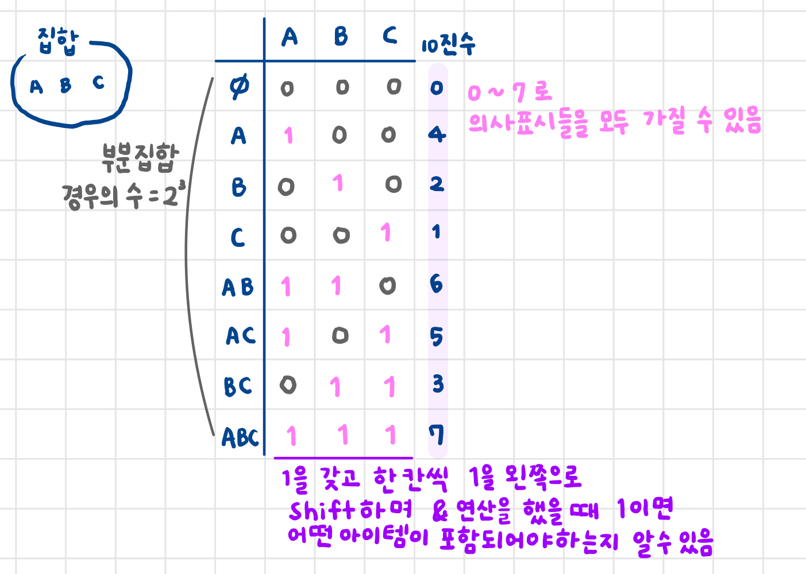
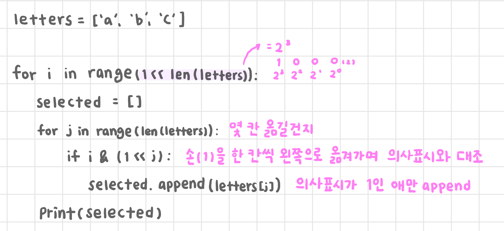

# 비트 연산
- 이진법
- 단축 평가 발생하지 않음
- 연산이 빠름

| 연산자 종류 |효과|수식|
|--------|---|---|
| &      |and|a & b|
| \|     |or|a | b|
| <<     |왼쪽 shift|a << n|
| \>>    |오른쪽 shift|a >> n|
|^|xor|a ^ b|

~~~python
a = {1, 2, 3}
b = {3, 4, 5}
print(a & b)  # 교집합 {3}
print(a | b)  # 합집합 {1, 2, 3, 4, 5}

print(3 & 6)

# 좌우에 set => 교집합
# 좌우에 10진수 => 비트 연산자
~~~

# &
- 이진수를 위 아래로 비교
- 둘 다 1일 때만 1
- 비트 검출할 때 사용(비트가 켜져 있는지 아닌지 확인하기 위해 1을 갖고 비교)

# |
- 이진수를 위 아래로 비교
- 둘 중 하나만 1이면 1

# << (왼쪽 shift)
- 비트를 왼쪽으로 n칸 이동
- 새로 생긴 부분은 0으로

# \>> (오른쪽 shift)
- 비트를 오른쪽으로 n칸 이동
- 오른쪽으로 없어진 부분은 삭제

# XOR(exclusive or, 배타적 논리쌍)
- 비교하고자 하는 비트가 달라야지만 1
- 외톨이 골라내기

~~~python
nums = [77, 26, 34, 5, 5, 26, 34, 17, 24, 17, 24]

# 1. 리스트 집계
# max 값 찾기 => max 값을 인덱스로 갖는 리스트 만들어서 집계
# 리스트가 엄청 커질 수 있음

# 2. dict 집계
# 공간 복잡도 큼

# 3. set 중복 제거 + count
# set을 만드는 데 오래 걸림
# 돌면서 count => 시간 복잡도 큼

# 4. sort
# O(NlogN)

# 5. xor
# O(N)

answer = 0
for num in nums:
    answer ^= num
print(answer)
~~~

## 부분집합 구하기
~~~python
letters = ['a', 'b', 'c']

for i in range(1 << len(letters)):
    selected = []
    for j in range(len(letters)):
        if i & (1 << j):
            selected.append(letters[j])

    print(selected)

# []
# ['a']
# ['b']
# ['a', 'b']
# ['c']
# ['a', 'c']
# ['b', 'c']
# ['a', 'b', 'c']
~~~

