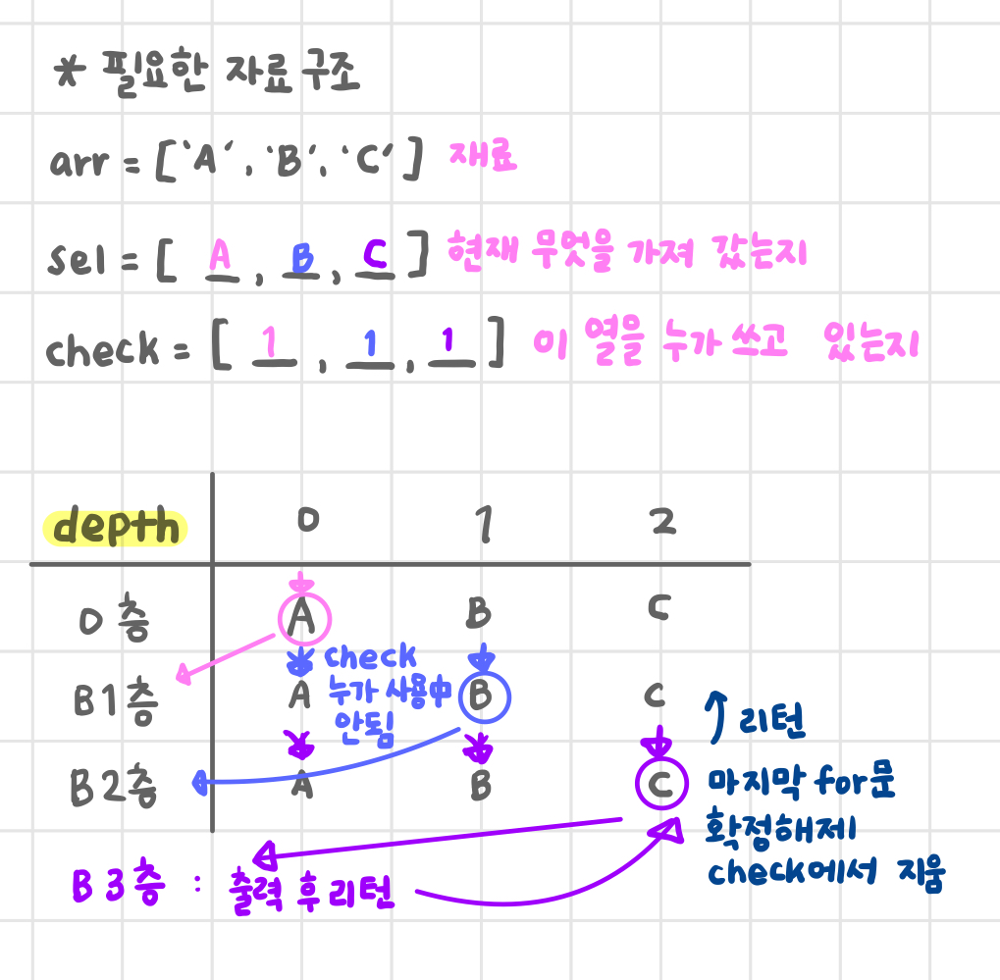

# 순열
- 순서 중요
- O(N!)

## 포문 순열
- 아래 예시는 27번 연산 해야 함
~~~python
arr = ['A', 'B', 'C']

for i in range(3):
    for j in range(3):
        for k in range(3):
            if i != j and j != k and k != i:
                print([arr[i], arr[j], arr[k]])
~~~

## 재귀 순열

~~~python
arr = ['A', 'B', 'C']
sel = [0, 0, 0]
check = [0, 0, 0]

def perm(depth):
    if depth == 3:
        print(sel)
        return

    for i in range(3):
        if not check[i]:  # 화살표가 멈출 수 있으면(아무도 쓰지 않고 있는 자리이면)
            check[i] = 1
            sel[depth] = arr[i]  # 확정
            perm(depth + 1)
            check[i] = 0  # 🚨 돌아 나오면서 확정 해제

perm(0)
~~~

## 중복 순열
- check 관련 코드만 없애면 중복 순열 코드가 됨
~~~python
arr = ['A', 'B', 'C']
sel = [0, 0, 0]

def perm_rep(depth):
    if depth == 3:
        print(*sel)
        return

    for i in range(3):
        sel[depth] = arr[i]
        perm_rep(depth+1)

perm_rep(0)
~~~

# 백트래킹
- 가지치기
- promising하지 않은 방법들을 제거한다
- 유망하지 않은 연산을 하지 않는다