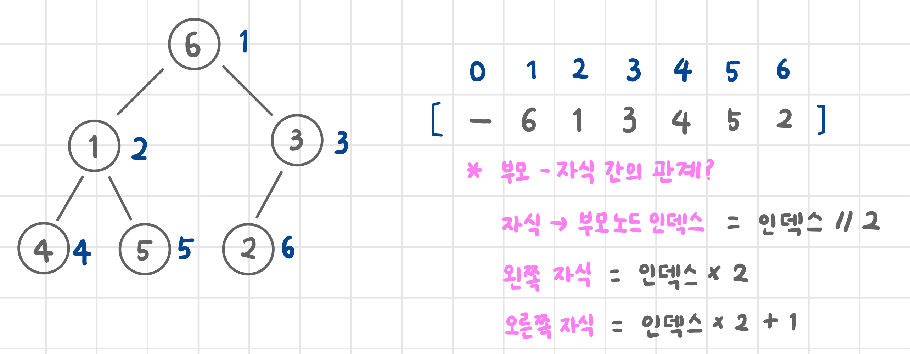

# 트리

- 싸이클이 존재하지 않는다
  - 간선을 끊으면 두 덩이로 나뉨
  - 나눠진 덩어리 = sub tree
- 차수가 존재 함
- 노드의 개수 = 간선의 개수 + 1
- 잡 트리(규칙성이 없는 트리) : 트리도 그래프의 일종 ➡️ 인접행렬로 정리

## 이진트리(잡 이진트리, 완전 이진트리, 포화 이진트리)
- 자식 노드가 많아봐야 최대 두 개인 경우

|이름|설명|
|---|---|
|잡 이진트리|자식만 2개 이하, 별다른 규칙 없음|
|완전 이진트리|왼쪽부터 차곡차곡 쌓음|
|포화 이진트리|모든 차수의 노드들이 꽉 차 있음|

### 잡 이진트리

### 완전 이진트리

### 포화 이진트리

# 힙 자료구조
- 완전 이진트리

## 최소힙
- 루트 노드가 무조건 최소값
- 부모 노드의 숫자가 자식 노드 숫자의 크기보다 작음
- 가장 작은 값을 logN 시간 만에 찾을 수 있게 함
### 삽입 연산 : heap push
### 삽입 삭제 : heap pop
~~~python
heap = ['최소힙:']

def heap_push(item):
    heap.append(item)  # 1. 일단 맨 끝에 넣는다

    child = len(heap) - 1  # 자기자신은 방금 붙인 걔
    parent = child // 2  # 부모는 반토막 index

    # 루트 노드가 아닌 한 + 최소힙이지만 부모가 크다면 바꿔야하니까?
    while parent and heap[parent] > heap[child]:
        heap[parent], heap[child] = heap[child], heap[parent]  # 스왑
        child = parent  # 이제 아이가 부모가 되고
        parent = child // 2  # 부모는 아이 index의 반토막

def heap_pop():
    if len(heap) == 1:
        print('힙이 비어있어 삭제가 불가능합니다!')
        return

    result = heap[1]
    heap[1] = heap[-1]  # 제일 아래 우측 값 root로
    heap.pop()

    parent = 1
    child = parent * 2  # 일단 좌측 child 기준으로 잡고

    if child+1 <= len(heap)-1:  # 우측이 트리상에서 존재하는 경우 + (완전 이진 트리이기 때문에 왼쪽은 존재)
        if heap[child] > heap[child+1]:  # 좌측이 우측보다 더 큰 경우
            child += 1  # 우측 자식 기준으로 자식의 자격을 바꿈
            # 왜냐면 자리 바꿀때 더 작은 값이 최소힙의 경우 우선순위가 높아서
            
    while child <= len(heap)-1 and heap[parent] > heap[child]:
        heap[parent], heap[child] = heap[child], heap[parent]
        parent = child
        child = parent * 2
        if child + 1 <= len(heap) - 1:
            if heap[child] > heap[child + 1]:
                child += 1

    return result  # 최소 값을 반환

heap_push(33)
print(heap)
heap_push(12)
print(heap)
heap_push(7)
heap_push(19)
heap_push(21)
print(heap)
heap_push(5)
print(heap)
heap_push(8)
print(heap)
print(heap_pop())
print(heap)
print(heap_pop())
print(heap)
print(heap_pop())
print(heap)
print(heap_pop())
print(heap)
print(heap_pop())
print(heap)
print(heap_pop())
print(heap)
~~~

## 최대힙
- 루트 노드가 무조건 최대값

## 힙큐 모듈
~~~python
import heapq  # 힙큐 모듈은 '최소힙'이다!

# 일반적인 잡 리스트를 힙으로 만들어버리기 => 원본을 바꿔버린다는 게 포인트
arr = [2, 4, 7, 3, 5, 8]
heapq.heapify(arr)
print('#1 힙으로 만들기', arr)  # [2, 3, 7, 4, 5, 8]
print('------------------------------------')

# 힙 푸시
print('#2 힙푸시')
heap = []
heapq.heappush(heap, 8)  # 리턴값이 없어서 None임
print(heap)
heapq.heappush(heap, 5)
print(heap)
heapq.heappush(heap, 3)
print(heap)
heapq.heappush(heap, 6)
print(heap)
print('------------------------------------')

# 힙팝
print('#3 힙팝')
heapq.heappop(heap)
print(heap)
heapq.heappop(heap)
print(heap)
heapq.heappop(heap)
print(heap)
res = heapq.heappop(heap)
print(heap)
# 없는 상태에서 뽑으려면 index out of range가 난다!
# heapq.heappop(heap)
print('res에 담김: ', res)
print('------------------------------------')

# 힙에는 그럼 숫자만 넘길수있나?
# 가중치 정리할 때
print('#4 튜플 넘기기')
min_heap = []
heapq.heappush(min_heap, (3, 5))  # '앞쪽' 숫자를 기준으로 최소힙을 만든다!
heapq.heappush(min_heap, (1, 6))
heapq.heappush(min_heap, (4, 'hihi'))  # 그러니까 앞에만 숫자이면 됨
# heapq.heappush(min_heap, ('그러니까 이건 오류남', 'hihi'))
print(min_heap)
print('------------------------------------')

# 그러면 최대힙은 어떻게 할건데? => 앞쪽을 기준으로 최소힙을 만든다는 점을 활용
# (내가 구하고자 하는 값의 -를 줘서 우선순위가 거꾸로 하게 함, 진짜 내가 활용하고 싶은 숫자)
print('#5 최대힙')
max_heap = []
heapq.heappush(max_heap, (-3, 3))
heapq.heappush(max_heap, (-5, 5))
heapq.heappush(max_heap, (-4, 4))
print(max_heap)
~~~