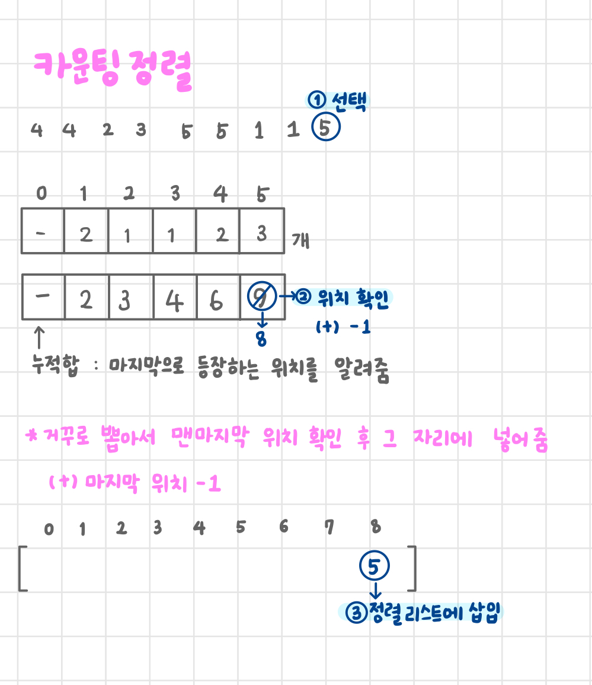
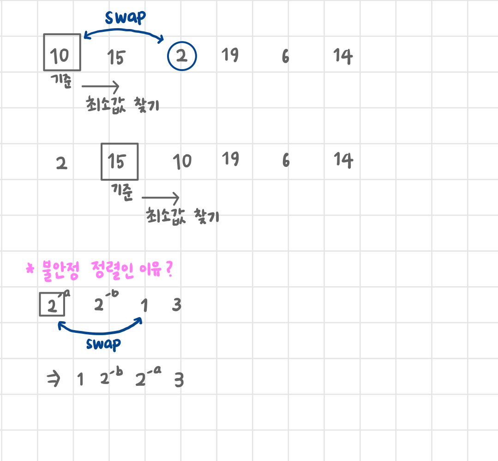
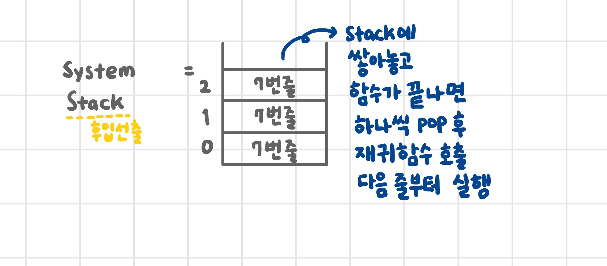
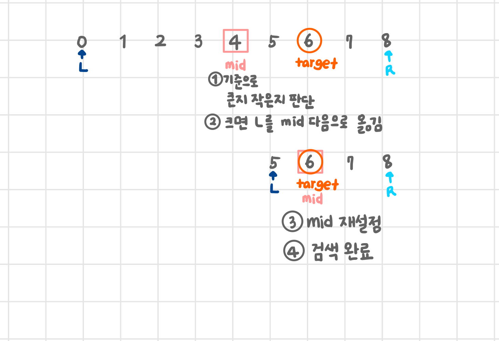
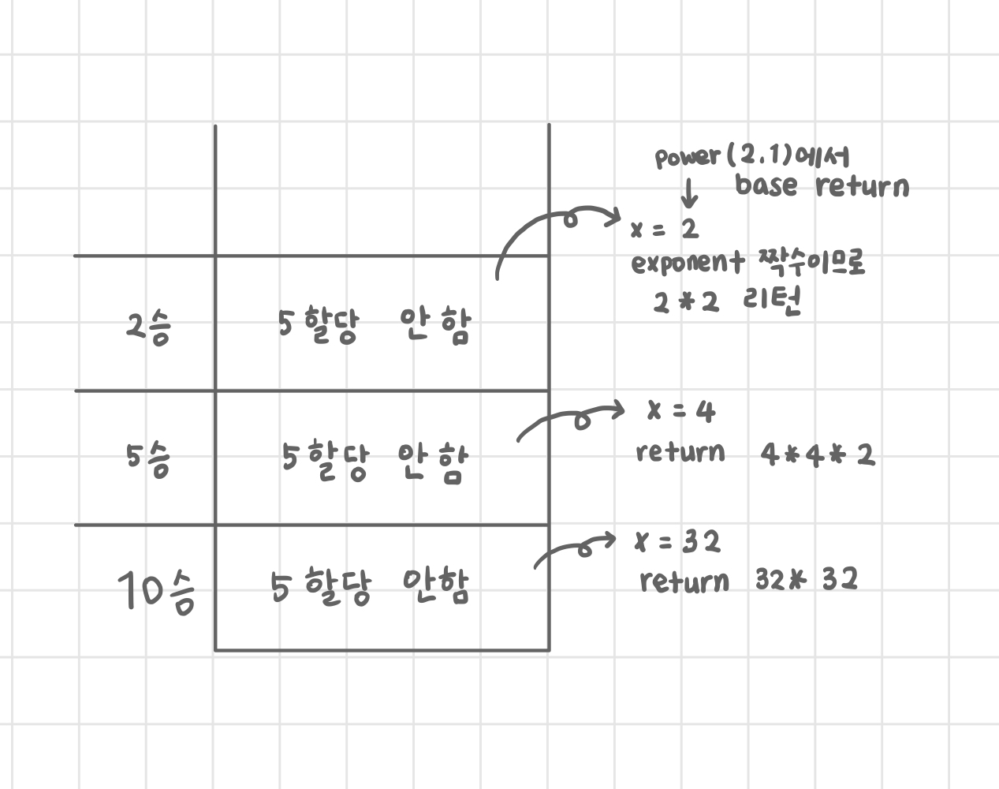

# 스트링 알고리즘
- 테스팅 : 5개 6개로 하는게 좋음(level, banana)

# two pointer
- 인덱싱 두 번 함
- 아닌 경우를 찾아냄

## 문자열 포함 여부 검사하기
~~~python
t = 'hello world'
p = 'wor'

def find_word(p, t):
    N = len(t)
    M = len(p)

    for i in range(N - M + 1):
        cnt = 0
        for j in range(M):
            if t[i + j] == p[j]:  # 포인터를 t에 하나 p에 하나 두는 것
                cnt += 1
            else:
                break

        if cnt == M:
            return i

    return '못찾았음'

print(find_word(p, t))
~~~

# ASCII 값
- 'a' < 'c' ✅ True가 되는 이유
- 문자열 리스트가 sort 되는 이유 ➡️ 사전식, lexicographic sorting
- 주의❗
~~~python
nums = ['5', '2', '9', '1', '11', '4']
nums.sort()
# '1', '11', '2', '4', '5', '9'
# ➡️ 숫자로 변환 후 사용하는 것이 좋다
~~~
- ➡️ 내부의 ASCII 코드 값을 비교한 것

# 정렬 알고리즘
- 안정 정렬? 순서를 지켜가면서 정리하고 싶을 때
- 안정 정렬 : 버블 정렬, **카운팅 정렬**, 병합 정렬
- 불안정 정렬 : 선택 정렬, 퀵 정렬

## 버블정렬
- 정렬하고자하는 리스트의 길이 - 1회 시행
~~~python
arr = [2, 4, 1, 3]

for i in range(len(arr) - 1, 0, -1):  # 총 3회 시행하는데 3, 2, 1 순서
    for j in range(i):
        if arr[j] > arr[j + 1]:
            arr[j], arr[j + 1] = arr[j + 1], arr[j]  # swap

print(arr)
~~~

## 카운팅 정렬

~~~python
nums = [4, 4, 2, 3, 5, 5, 1, 1, 5]

count = [0] * (max(nums) + 1)  # 각각 숫자가 몇 개씩 있는지 개수 세기
sorted_nums = [0] * len(nums)  # 정렬된 리스트 틀

# 집계
for num in nums:
    count[num] += 1

# 누적합
for i in range(1, len(count)):
    count[i] = count[i] + count[i-1]
    
for j in range(len(nums)-1, -1, -1):
    sorted_nums[count[nums[j]] - 1] = nums[j]
    count[nums[j]] -= 1
    
print(sorted_nums)
~~~

## 선택 정렬
- 첫 숫자를 가장 작은 것으로 가정 후 나보다 뒤에있는 것 중 제일 작은 애를 골라서 swap
- 불안정 정렬

# LEGB Rule
- 변수 참조 순서 L➡️E➡️G➡️B

|✅|의미|
|---|---|
|L|Local, 함수 안|
|E|Enclosed, 함수 안의 함수|
|G|Global, 함수 밖|
|B|Built-in, 파이썬 내장 함수|

# 재귀 함수
- 똑같은 행동을 조건만 바꿔서 계속 해야 할 때

~~~python
def fibo(n):
    if n < 2:
        return n
    else:
        return fibo(n - 1) + fibo(n - 2)

print(fibo(10))
~~~

# 이진 검색
- 전제 : 데이터셋이 정렬되어 있어야 한다
- 이진 검색 문제 : 입력이 말도 안되게 큰 편
- 예 : 업다운 게임
- 시간 복잡도 : logN

~~~python
nums = [1, 2, 3, 4, 5, 6, 7, 8, 9]

def binary_search(low, high, target):
    if low > high:  # 포인터 크로스
        return '찾지 못함'

    mid = (low + high) // 2
    if target == nums[mid]:
        return mid
    elif target < nums[mid]:
        return binary_search(low, mid - 1, target)
    elif target > nums[mid]:
        return binary_search(mid + 1, high, target)

print(binary_search(0, len(nums) - 1, 7))
~~~

# 분할 정복
- 하나의 조각을 쪼개서 계산
~~~python
def power(base, exponent):
    if exponent == 1:
        return base

    x = power(base, exponent // 2)
    if exponent % 2:
        return x * x * base
    else:
        return x * x

print(power(2, 10))
~~~

