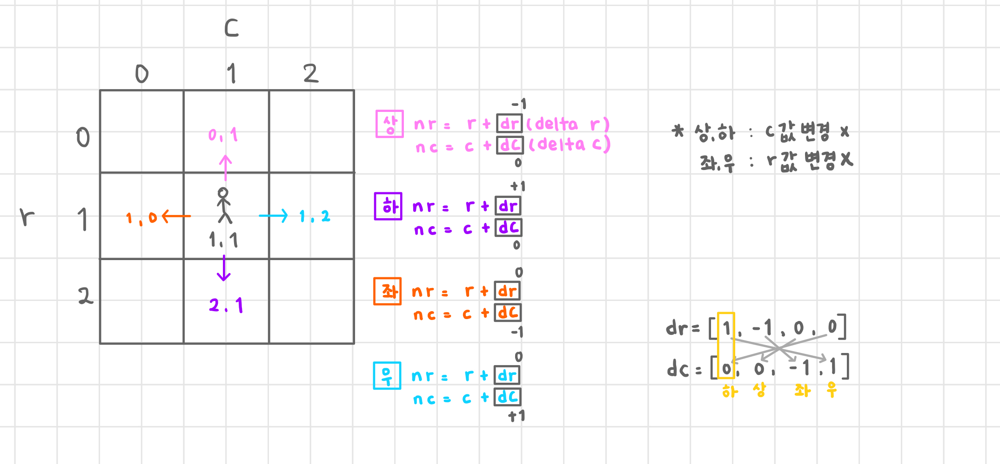

# 2차원 리스트
- 특정한 행렬 표현
~~~python
# 🚨 주의!
b = [[0] * 3] * 3  # [[0, 0, 0], [0, 0, 0], [0, 0, 0]]
b[0][0] = 9  # [[9, 0, 0], [9, 0, 0], [9, 0, 0]]

c = [[1, 2], [3, 4]]
d = c[:]  # shallow copy : [[1, 2], [3, 4]]
c[1][1] = 5
print(d)  # [[1, 2], [3, 5]]
~~~

## list comprehension 사용
~~~python
a = []

for i in range(3):
    b = [0] * 3
    a.append(b)

print(a)  # [[0, 0, 0], [0, 0, 0], [0, 0, 0]]
a[0][0] = 9
print(a)  # [[9, 0, 0], [0, 0, 0], [0, 0, 0]]

# ✨ list comprehension
c = [[0] * 3 for _ in range(3)]  # [[0, 0, 0], [0, 0, 0], [0, 0, 0]]
~~~

# 2차원 리스트 copy
## 직접 구현
~~~python
matrix = [[3, 7, 9], [4, 2, 6], [8, 1, 5]]
new_matrix = []

for m in matrix:
    new_matrix.append(m[:])

print(new_matrix)  # [[3, 7, 9], [4, 2, 6], [8, 1, 5]]

# ✨ list comprehension
new_matrix2 = [m[:] for m in matrix]
~~~
## deepcopy 모듈
~~~python
import copy

matrix = [[3, 7, 9], [4, 2, 6], [8, 1, 5]]
a = copy.deepcopy(matrix)  # [[3, 7, 9], [4, 2, 6], [8, 1, 5]]
~~~

# 순회
~~~python
matrix = [[3, 7, 9],
          [4, 2, 6],
          [8, 1, 5]]

# 행 우선 순회
for r in range(3):
    for c in range(3):
        print(matrix[r][c])  # 3 7 9 4 2 6 8 1 5
        
# 열 우선 순회
for r in range(3):
    for c in range(3):
        print(matrix[c][r])  # 3 4 8 7 2 1 9 6 5
~~~
~~~python
N = 3
matrix = [[3, 7, 9],
          [4, 2, 6],
          [8, 1, 5]]

# 행 우선 순회
for i in range(N ** 2):
    print(matrix[i // N][i % N])
~~~

# 전치
- 방향 반대될 때
~~~python
matrix = [[3, 7, 9],
          [4, 2, 6],
          [8, 1, 5]]

for r in range(3):
    for c in range(3):  # 행 우선 순회 코드
        if r > c:  # r < c도 됨(but 한 번만 해야함) / r == c는 [0][0], [1][1], [2][2]
            matrix[r][c], matrix[c][r] = matrix[c][r], matrix[r][c]
~~~

## zip 활용
~~~python
a = [1, 2, 3]
b = [4, 5, 6]
print(list(zip(a, b)))  # [(1, 4), (2, 5), (3, 6)]
# 세로로 묶어서 튜플로 만듦
c = [7, 8, 9]
# zip 이용하여 전치
print(list(zip(a, b, c)))  # [(1, 4, 7), (2, 5, 8), (3, 6, 9)]

d = [1, 2, 3, 4]
e = [5, 6]
f = [7, 8, 9]
print(list(zip(d, e, f)))  # [(1, 5, 7), (2, 6, 8)]

matrix = [[3, 7, 9],
          [4, 2, 6],
          [8, 1, 5]]

zipped_matrix = list(zip(*matrix))  # * : unpacking 연산자 / 이차원 리스트를 풀어서 넣기
# * 안쓰면...
print(list(zip(matrix)))  # [([3, 7, 9],), ([4, 2, 6],), ([8, 1, 5],)]

# 전치 완료 후, 원소를 리스트로 활용
transposed_matrix = list(map(list, zip(*matrix)))
print(transposed_matrix)  # [[3, 4, 8], [7, 2, 1], [9, 6, 5]]
~~~

# 회전
~~~python
matrix = [[1, 2, 3],
          [4, 5, 6],
          [7, 8, 9]]

n = 3
rotated_matrix = [[0] * n for _ in range(n)]

for i in range(n):
    for j in range(n):
        rotated_matrix[i][j] = matrix[n-j-1][i]  # 원본 리스트 : 열 우선 순회
~~~
## zip 이용
~~~python
rotated_matrix = list(zip(*matrix[::-1]))
print(rotated_matrix)  # [(7, 4, 1), (8, 5, 2), (9, 6, 3)]
~~~

# 델타 탐색
- 2차원 리스트 dfs

~~~python
r = c = 1  # 중간에 있다고 가정
dr = [1, -1, 0, 0]
dc = [0, 0, -1, 1]
# 하, 상, 좌, 우

for i in range(4):
    nr = r + dr[i]  # 두 칸씩 가는 경우 r + dr[i] * 2
    nc = c + dc[i]
    print(nr, nc)
~~~