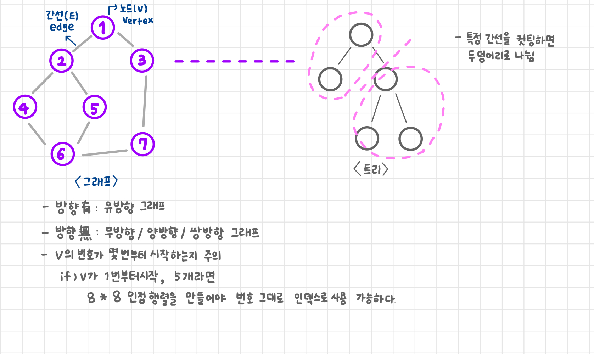
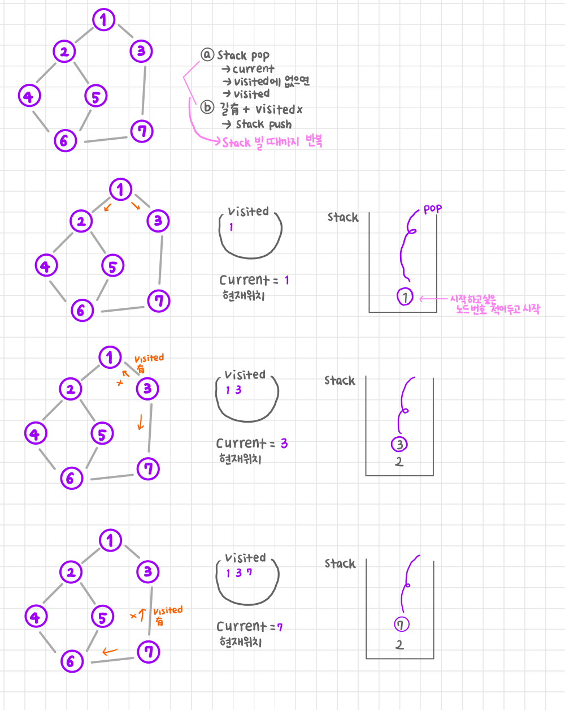
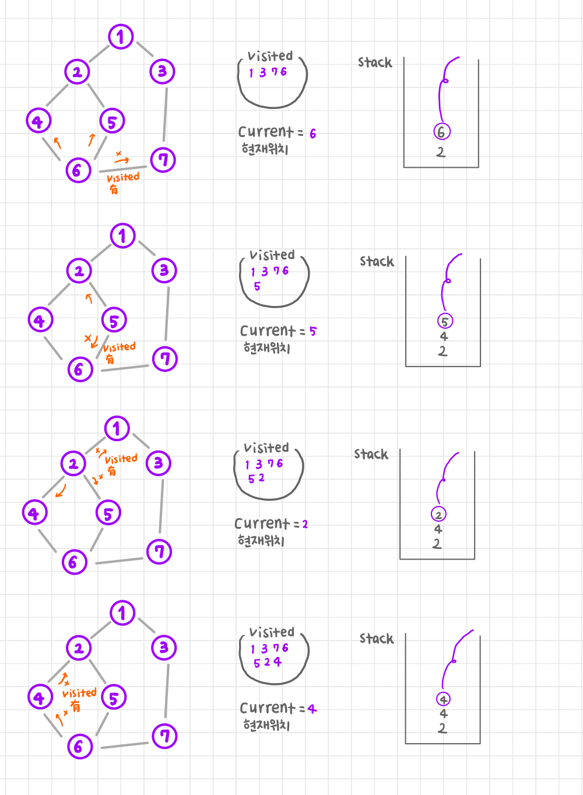
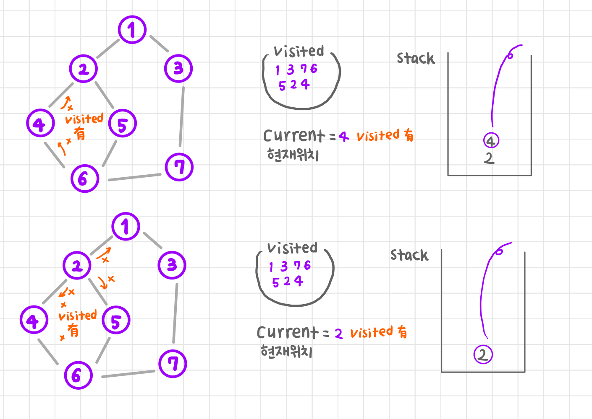

> - [DFS (Depth First Search, 깊이 우선 탐색)](#dfs-depth-first-search-깊이-우선-탐색)
> - [BFS (Breath First Search, 너비 우선 탐색)](#bfs-breath-first-search-너비-우선-탐색)

## 인접 행렬
- 필요 없는 0이 많아질 수 있음
- 공간은 많이 필요하지만, seacrch시 시간 복잡도가 O(1)
- 간선 개수가 많을 때 유리
~~~python
V, E = map(int, input().split())  # Vertex, Edge 개수
# V가 1로 시작하면 0 ~ 8, 8 * 8 인접 행렬을 만들어 주어야 함

adj_matrix = [[0] * (V + 1) for _ in range(V + 1)]  # 1부터 시작하니까 0은 안 쓰고 / 1 ~ V + 1

for _ in range(E):  # 간선 갯수만큼 돌면서 연결 정보를 받음
    start, end = map(int, input().split())
    adj_matrix[start][end] = 1
    adj_matrix[end][start] = 1  # 양방향 그래프니까

# 결과
# [[0, 0, 0, 0, 0, 0, 0, 0],
#  [0, 0, 1, 1, 0, 0, 0, 0],
#  [0, 1, 0, 0, 1, 1, 0, 0],
#  [0, 1, 0, 0, 0, 0, 0, 1],
#  [0, 0, 1, 0, 0, 0, 1, 0],
#  [0, 0, 1, 0, 0, 0, 1, 0],
#  [0, 0, 0, 0, 1, 1, 0, 1],
#  [0, 0, 0, 1, 0, 0, 1, 0]]
~~~

## 인접 리스트
- 공간 복잡도가 줄어듦
- search시 시간 복잡도 O(N)
- 열의 길이 줄어듦(행은 줄이지 못했지만, 열은 압축)
- 가중치 나타낼 때 번거로움(노드 번호, 가중치가 다 있는 객체를 넣어야 함)
~~~python
V, E = map(int, input().split())

adj_list = [[] for _ in range(V + 1)]

for _ in range(E):
    start, end = map(int, input().split())
    adj_list[start].append(end)
    adj_list[end].append(start)  # 양방향

# [[], [2, 3], [1, 4, 5], [1, 7], [2, 6], [2, 6], [4, 5, 7], [6, 3]]
# 조회시 in 연산자 사용 ➡️ O(N)
# ✅ 조회가 많은 경우
# 리스트 안의 원소를 set으로 ➡️ 순서가 중요한 경우 불가
~~~

# DFS (Depth First Search, 깊이 우선 탐색)
- 문제 플이 방식 : stack, 재귀
- 군집 탐색

## DFS - stack

- 아래 코드 : stack에 중복되어 들어갈 가능성 있음!
### stack + 인접 행렬
~~~python
V, E = map(int, input().split())  # Vertex, Edge 개수

adj_matrix = [[0] * (V + 1) for _ in range(V + 1)]

for _ in range(E):  # 간선 갯수만큼 돌면서 연결 정보를 받음
    start, end = map(int, input().split())
    adj_matrix[start][end] = 1
    adj_matrix[end][start] = 1  # 양방향 그래프니까

stack = [1]  # 시작점
visited = []

while stack:  # 스택이 빌 때까지
    current = stack.pop()
    if current not in visited:
        visited.append(current)

    for destination in range(V + 1):
        if adj_matrix[current][destination] and destination not in visited:
            # 갈 수 있고 + 방문하지 않은 곳
            stack.append(destination)

print('이동 경로: ', *visited)
# 이동 경로:  1 3 7 6 5 2 4
~~~

### stack + 인접 리스트
~~~python
V, E = map(int, input().split())

adj_list = [[] for _ in range(V + 1)]

for _ in range(E):
    start, end = map(int, input().split())
    adj_list[start].append(end)
    adj_list[end].append(start)  # 양방향

stack = [1]
visited = []

while stack:
    current = stack.pop()
    if current not in visited:
        visited.append(current)

    for destination in adj_list[current]:  # 인접 리스트와 다른 부분
        if destination not in visited:
            stack.append(destination)

print('이동 경로: ', *visited)
~~~

## DFS - 재귀
- 재귀 : 똑같은 로직을 조건만 바꿔서 계속 돌리고 싶을 때 사용
- DFS : 매번 같은 행동함
- 여러 조건을 한 번에 확인해야 할 때
~~~python
def dfs(n):
    if n not in visited:
        visited.append(n)

    for destination in range(V + 1):
        if adj_matrix[n][destination] and destination not in visited:
            dfs(destination)

V, E = map(int, input().split())

adj_matrix = [[0] * (V + 1) for _ in range(V + 1)]

for _ in range(E):
    start, end = map(int, input().split())
    adj_matrix[start][end] = 1
    adj_matrix[end][start] = 1

visited = []

dfs(1)

print('이동 경로 : ', *visited)
~~~

# BFS (Breath First Search, 너비 우선 탐색)
- 최단 거리
- Queue(선입선출)